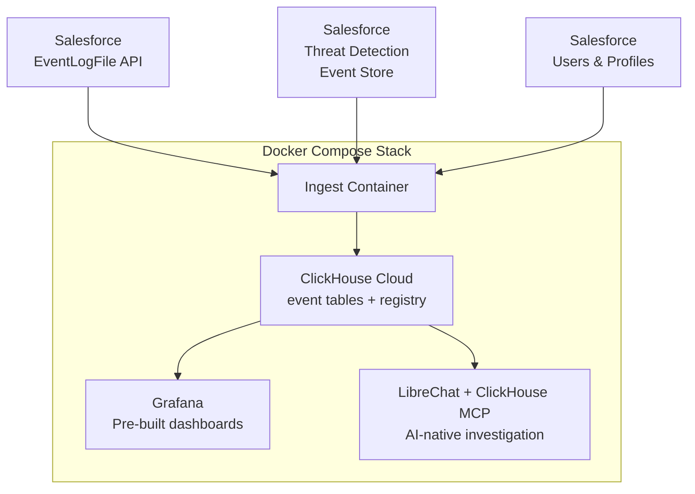

# Salesforce Observability with ClickHouse

Near-real-time security and operational observability for Salesforce orgs — built on ClickHouse Cloud, Grafana, and LibreChat with a ClickHouse MCP server.

## What it does

Pulls Salesforce [EventLogFile](https://developer.salesforce.com/docs/atlas.en-us.object_reference.meta/object_reference/sforce_api_objects_eventlogfile.htm) data and [Threat Detection events](https://help.salesforce.com/s/articleView?id=sf.real_time_em_threat_detection.htm) into ClickHouse Cloud, then surfaces them in Grafana dashboards and a LibreChat AI interface for natural-language investigation.

**What you can monitor:**
- Login activity — who logged in, from where, via which integration, success vs failure
- API usage — which connected apps are consuming your daily limit, billable vs non-billable calls
- REST, SOAP, Bulk API attribution by connected app, user, and endpoint
- Admin changes — SetupAuditTrail ingested and queryable
- Security events — CredentialStuffing, SessionHijacking, ReportAnomaly, ApiAnomaly
- Apex performance, Flow execution, Lightning page load times

## Architecture



## Prerequisites

- [Docker Desktop](https://www.docker.com/products/docker-desktop/) — install this first if you don't have it
- [ClickHouse Cloud](https://clickhouse.cloud/) account (free tier works)
- Salesforce org with [Event Monitoring](https://help.salesforce.com/s/articleView?id=sf.real_time_em_buying.htm) enabled
- Java and OpenSSL — required for private key extraction
- An Anthropic API key (for LibreChat AI features — optional)

## Quick start

See **[QUICKSTART.md](QUICKSTART.md)** for the full step-by-step setup guide (~25 minutes).

The setup order matters: create the Salesforce certificate first, configure the External Client App and upload the certificate to it, extract the private key, fill in `.env`, then start the stack. The detailed guide walks through each step with all required commands and Salesforce UI clicks.

## Dashboards

| Dashboard | What it shows |
|---|---|
| **Logins - Salesforce Prod** | Login activity by status, source IP, browser/user-agent, success/failure ratio |
| **Salesforce - API Performance** | API call volume vs your daily API limit, billable vs non-billable, top connected apps |
| **Salesforce - API & Integration Health** | Error rates by API family and endpoint |
| **Salesforce - Security Events** | Threat detection events — credential stuffing, session hijacking, anomalies |
| **Salesforce - Operational Health** | Setup audit trail, permission changes, admin activity |
| **Salesforce - Page Performance** | Page/endpoint performance, slow requests |
| **Salesforce Performance & Health** | Apex execution, trigger performance, Flow execution |
| **Threats & Access** | Login-as activity (admin impersonation), threat store events |
| **Ingestion Pipeline Health** | Pipeline status, ingested log files per event type, run diagnostics and error tracking |

## Connected app registry

Salesforce identifies integrations in event logs using opaque numeric IDs rather than human-readable names. The registry maps those IDs to app names so dashboards and queries can display "Amazon AppFlow" instead of `8883i000001R3QM`.

The registry is a CSV file (`schema/connected_app_registry.csv`) loaded into a `connected_app_registry` ClickHouse table. All dashboards and queries join against it automatically. Unknown apps are **never excluded** from totals — they appear using their raw ID until added to the registry.

### 15-char vs 18-char IDs

Salesforce exposes connected app IDs in two different lengths depending on the source:

| Source | ID length | Example |
|---|---|---|
| **EventLogFile CSV** (what we ingest) | **15-char** | `8888Z000000pihz` |
| **`ApiTotalUsageEventLog` SOQL object** | **18-char** | `8888Z000000pihzQAA` |

The registry uses **15-char IDs**. If you look up an ID via SOQL, strip the last 3 characters. When writing SOQL queries that filter by connected app ID, use `LIKE '8888Z000000pihz%'` rather than an exact match.

### Finding unknown app IDs

| Prefix | Type | How to identify |
|---|---|---|
| `0H4` | Connected App (modern OAuth 2.0) | **Setup → Apps → Connected Apps** — search by name |
| `888` | OAuthConsumer / Remote Access (legacy) | **Contact Salesforce Support** — not visible in Setup UI |

The "Unregistered Connected Apps (Action Required)" panel in Grafana surfaces unknown IDs automatically. You can also run this query to find gaps:

```sql
SELECT
    t.connected_app_id,
    count() AS total_calls,
    countIf(t.counts_against_api_limit = 1) AS billable_calls,
    uniq(t.user_name) AS distinct_users,
    min(toDate(t.timestamp)) AS first_seen,
    max(toDate(t.timestamp)) AS last_seen
FROM api_total_usage_events t FINAL
LEFT JOIN connected_app_registry r FINAL
    ON t.connected_app_id = r.connected_app_id
WHERE t.timestamp >= now() - INTERVAL 30 DAY
  AND t.connected_app_id != ''
  AND r.connected_app_id = ''
GROUP BY t.connected_app_id
ORDER BY billable_calls DESC
```

## Authentication

The ingest pipeline uses **JWT/ECA (certificate-based) authentication** — the Salesforce-recommended approach for unattended server processes. The pipeline signs a JWT with a private key; Salesforce validates it against the uploaded certificate and returns an access token. No human interaction is needed after initial setup.

Three environment variables are required:

| Variable | Description |
|---|---|
| `SF_JWT_CLIENT_ID` | Consumer Key from the External Client App |
| `SF_JWT_KEY_FILE` | Path to the private key file inside the container (`/app/cert/server.key`) |
| `SF_JWT_USERNAME` | Salesforce username the ingest runs as |

See [QUICKSTART.md](QUICKSTART.md) for the full certificate creation and ECA setup walkthrough.

### Access token (CI/CD only)

For pipelines that pre-obtain a token externally (e.g. a GitHub Actions workflow that runs `sf org login jwt` and injects the result):

```bash
SF_ACCESS_TOKEN=<token>
SF_INSTANCE_URL=https://yourorg.my.salesforce.com
```

Access tokens expire (typically 2–24 hours) and are not suitable for long-running containers.

## Configuration reference

See `.env.example` for all variables. Key ones:

| Variable | Description |
|---|---|
| `SF_JWT_CLIENT_ID` | Consumer Key from your Salesforce External Client App |
| `SF_JWT_KEY_FILE` | In-container path to the private key (`/app/cert/server.key`) |
| `SF_JWT_USERNAME` | Salesforce username the ingest runs as |
| `SF_INSTANCE_URL` | Salesforce org URL — use org My Domain, not `test.salesforce.com` |
| `CH_HOST` / `CH_PASSWORD` / `CH_DATABASE` | ClickHouse Cloud connection |
| `GRAFANA_ADMIN_PASSWORD` | Grafana admin password (username is always `admin`) |
| `INGEST_INTERVAL_SECONDS` | Ingest schedule in seconds (default: `7200` — 2 hours) |
| `ANTHROPIC_API_KEY` | For LibreChat AI features (optional) |

## Event types ingested

The pipeline captures 33 distinct Salesforce EventLogFile event types (34 ingest configurations — `ApiTotalUsage` is ingested both daily and hourly) plus 5 threat detection types from the Shield Event Store. See `SCHEMA_AUDIT.md` for a full field-by-field breakdown.

**EventLogFile types:** `Login`, `LoginAs`, `SalesforceLoginAs`, `Logout`, `RestApi`, `API` (SOAP), `BulkApi`, `BulkApi2`, `ApexTrigger`, `ApexExecution`, `ApexCallout`, `ApexUnexpectedException`, `FlowExecution`, `FlowNavMetric`, `URI`, `LightningPageView`, `LightningInteraction`, `MetadataApiOperation`, `NamedCredential`, `ReportExport`, `Report`, `Dashboard`, `Search`, `SearchClick`, `InsufficientAccess`, `PermissionUpdate`, `PackageInstall`, `GroupMembership`, `ContentTransfer`, `ContentDocumentLink`, `Attachment`, `DocumentAttachmentDownloads`, `ApiTotalUsage`

**Threat Detection types:** `CredentialStuffing`, `SessionHijacking`, `ApiAnomaly`, `ReportAnomaly`, `GuestUserAnomaly`

## Limitations

- **Data latency is near-real-time, not streaming.** Salesforce publishes EventLogFile data hourly (typically 1–3 hours after events occur). The ingest container runs every 2 hours by default. Set `INGEST_INTERVAL_SECONDS` to adjust.
- Requires the Salesforce Event Monitoring add-on (not included in standard org editions)
- The Salesforce daily API limit varies by org — check Setup → Company Information for your specific limit

## License

Apache License 2.0 — see [LICENSE](LICENSE).
